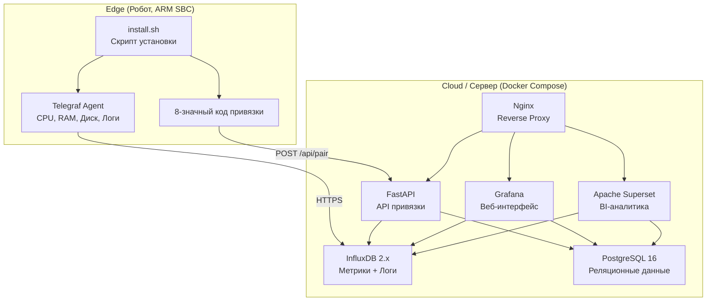

# WolfpackCloud Monitoring

[](https://github.com/ShiWarai/WolfpackCloud-monitoring/actions/workflows/ci.yml)
[](https://opensource.org/licenses/MIT)

Подсистема мониторинга для экосистемы [WolfpackCloud](https://github.com/ShiWarai/WolfpackCloud) — облачной платформы управления флотом мобильных роботов. Обеспечивает сбор метрик (CPU, RAM, диск, температура), логов и телеметрии с одноплатных компьютеров роботов (OrangePi5, Raspberry Pi) и их визуализацию в централизованной панели мониторинга.

## Возможности

- **Простая установка агента** — однострочный скрипт для ARM-устройств
- **8-значный код привязки** — безопасная регистрация роботов в панели мониторинга
- **Мониторинг в реальном времени** — CPU, RAM, диск, сеть, температура
- **Централизованные логи** — системные и application-логи в InfluxDB
- **Grafana дашборды** — готовые панели для обзора флота и детальной аналитики
- **Apache Superset** — BI-аналитика для продвинутого анализа данных
- **Docker Compose** — простое развёртывание серверной части
- **Ansible** — пакетная установка агентов на множество роботов
- **Локальное тестирование** — возможность проверки без реального робота

## Архитектура



## Быстрый старт

### 1. Развёртывание сервера

```bash
# Клонирование репозитория
git clone https://github.com/ShiWarai/WolfpackCloud-monitoring.git
cd WolfpackCloud-monitoring

# Копирование и настройка переменных окружения
cp .env.example .env
# Отредактируйте .env — задайте пароли и домен

# Запуск всех сервисов
docker compose up -d

# Проверка статуса
docker compose ps
```

После запуска доступны:
- **Grafana**: http://localhost:3000 (admin / admin)
- **API**: http://localhost:8000/docs
- **Superset**: http://localhost:8088 (admin / admin)
- **InfluxDB**: http://localhost:8086

### 2. Установка агента на робота

На одноплатном компьютере робота (OrangePi5, Raspberry Pi и др.) выполните:

```bash
curl -fsSL https://raw.githubusercontent.com/ShiWarai/WolfpackCloud-monitoring/main/agent/install.sh | bash -s -- --server YOUR_SERVER_URL
```

Скрипт:
1. Определит архитектуру (arm64/amd64)
2. Установит Telegraf
3. Сгенерирует 8-значный код привязки
4. Выведет код на экран — введите его в панели Grafana для подтверждения

### 3. Привязка робота в панели

1. Откройте Grafana → Dashboard → "Роботы"
2. Нажмите "Добавить робота"
3. Введите 8-значный код с экрана робота
4. Робот появится в списке и начнёт отправлять метрики

## Локальное тестирование (без робота)

Для тестирования на текущей машине:

```bash
# Установка "агента" локально
./scripts/local-install.sh

# Удаление локального агента
./scripts/local-uninstall.sh
```

## Структура проекта

```
WolfpackCloud-monitoring/
├── agent/                    # Компоненты для робота
│   ├── install.sh            # Скрипт установки агента
│   ├── uninstall.sh          # Скрипт удаления агента
│   ├── telegraf/             # Конфигурация Telegraf
│   └── ansible/              # Ansible плейбуки
├── server/                   # Серверные компоненты
│   ├── api/                  # FastAPI сервис привязки
│   ├── grafana/              # Дашборды и datasources
│   ├── influxdb/             # Инициализация InfluxDB
│   ├── postgres/             # SQL схема
│   ├── superset/             # Конфигурация Superset
│   └── nginx/                # Reverse proxy
├── scripts/                  # Вспомогательные скрипты
├── tests/                    # Интеграционные тесты
├── docker-compose.yml        # Production стек
└── docker-compose.dev.yml    # Dev окружение
```

## Технологический стек

| Компонент | Технология | Назначение |
|-----------|------------|------------|
| Агент | Telegraf | Сбор метрик и логов на роботе |
| Провиженинг | Ansible, install.sh | Установка и настройка агентов |
| API | FastAPI + SQLAlchemy | Сервис привязки роботов |
| Метрики | InfluxDB 2.x | Time-series БД для метрик и логов |
| Реляционные данные | PostgreSQL 16 | Реестр роботов, пользователи |
| Веб-интерфейс | Grafana OSS 11 | Основная панель мониторинга |
| BI-аналитика | Apache Superset | Продвинутый анализ данных |
| Прокси | Nginx | Reverse proxy, TLS |
| CI/CD | GitHub Actions | Линтинг, тесты, деплой |
| Контейнеры | Docker Compose | Оркестрация сервисов |

## Собираемые метрики

Telegraf на роботе собирает:

- **CPU** — загрузка по ядрам и общая
- **RAM** — использование памяти и swap
- **Диск** — использование разделов, I/O
- **Сеть** — трафик по интерфейсам
- **Температура** — температура CPU (критично для ARM)
- **Система** — uptime, load average
- **Логи** — syslog и application-логи

## Разработка

```bash
# Запуск dev-окружения с hot reload
docker compose -f docker-compose.yml -f docker-compose.dev.yml up -d

# Запуск тестов
make test

# Линтинг
make lint

# Сборка образов
make build
```

## Ansible: пакетная установка

Для установки агентов на множество роботов:

```bash
cd agent/ansible

# Настройте inventory
cp inventory.example.yml inventory.yml
# Отредактируйте inventory.yml — добавьте IP-адреса роботов

# Запуск плейбука
ansible-playbook -i inventory.yml playbook.yml
```

## API Reference

Документация API доступна по адресу `/docs` после запуска сервера.

Основные эндпоинты:
- `POST /api/pair` — регистрация робота, получение кода привязки
- `POST /api/pair/{code}/confirm` — подтверждение привязки
- `GET /api/robots` — список зарегистрированных роботов
- `GET /api/robots/{id}` — информация о роботе
- `DELETE /api/robots/{id}` — удаление робота

## Документация

Подробная документация доступна в [Wiki](https://github.com/ShiWarai/WolfpackCloud-monitoring/wiki):

- [Архитектура](https://github.com/ShiWarai/WolfpackCloud-monitoring/wiki/Architecture)
- [Установка агента](https://github.com/ShiWarai/WolfpackCloud-monitoring/wiki/Installation)
- [Настройка сервера](https://github.com/ShiWarai/WolfpackCloud-monitoring/wiki/Server-Setup)
- [Варианты деплоя](https://github.com/ShiWarai/WolfpackCloud-monitoring/wiki/Deployment-Options) — GitHub Actions, облако, свой сервер
- [API Reference](https://github.com/ShiWarai/WolfpackCloud-monitoring/wiki/API-Reference)
- [Grafana дашборды](https://github.com/ShiWarai/WolfpackCloud-monitoring/wiki/Grafana-Dashboards)
- [Устранение неполадок](https://github.com/ShiWarai/WolfpackCloud-monitoring/wiki/Troubleshooting)

## Связь с WolfpackCloud

Данная подсистема является частью экосистемы WolfpackCloud — облачной платформы для управления флотом мобильных роботов. Мониторинг интегрируется с основной платформой:

- Роботы регистрируются в общей БД WolfpackCloud
- Статус роботов (online/offline/error) отображается в основном дашборде
- Алерты о проблемах передаются в систему оповещений WolfpackCloud

## Лицензия

MIT License — см. [LICENSE](LICENSE)
